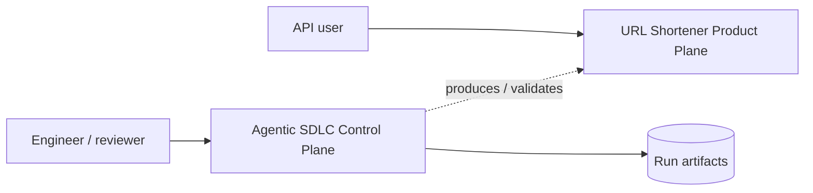
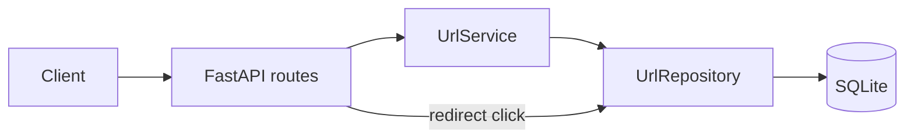
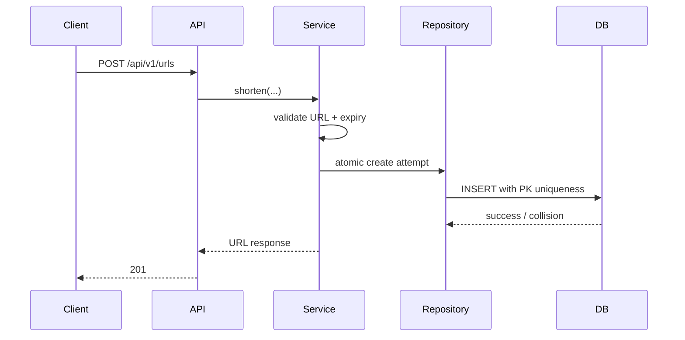
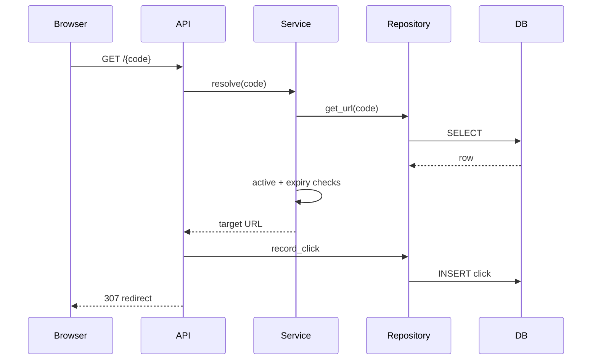
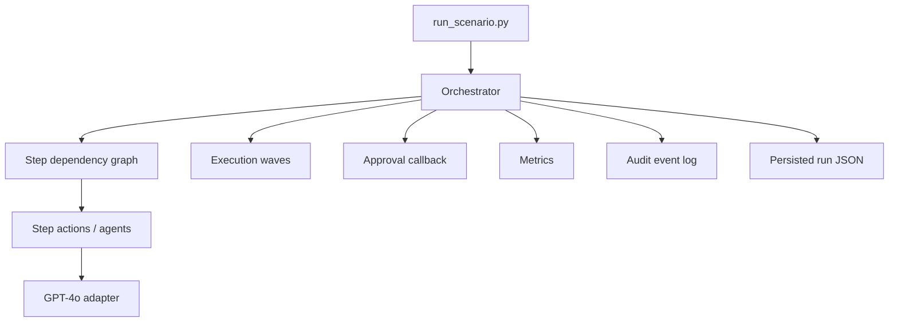
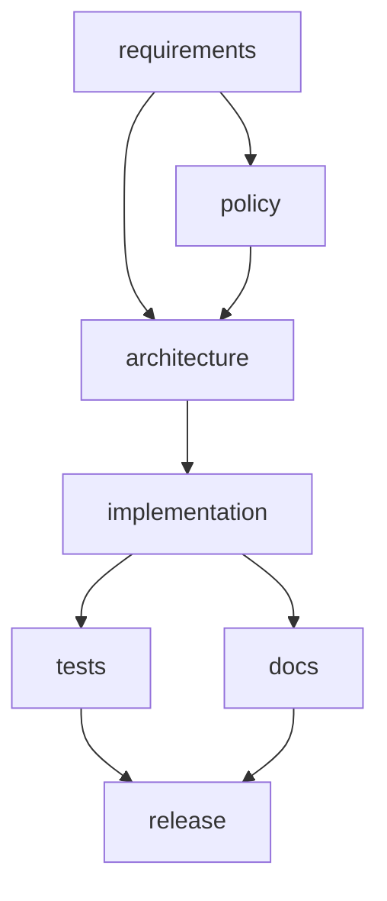
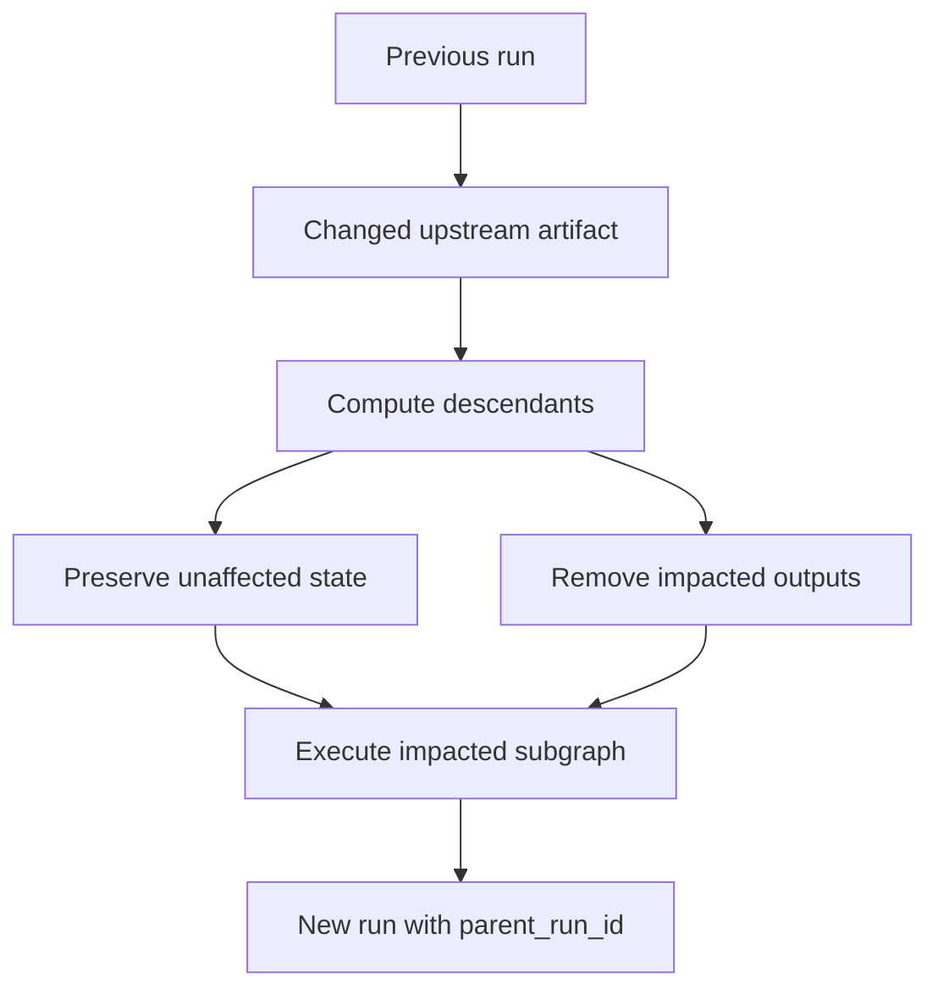
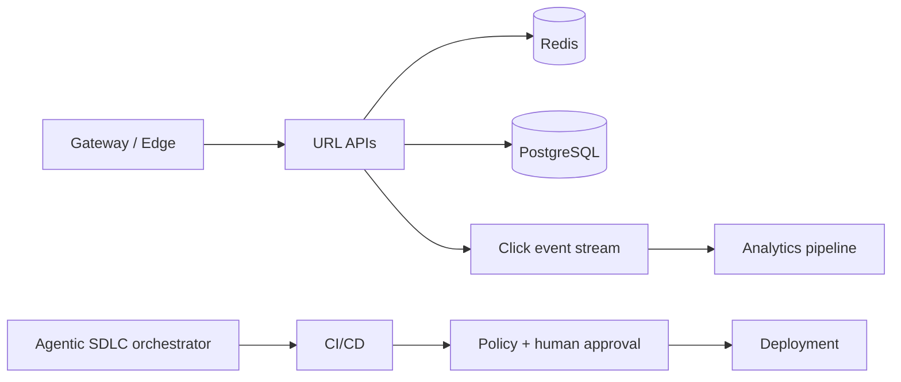

# Architecture and Orchestration Design

This document focuses on component boundaries, runtime control flow, state management, failure behavior, and production evolution.
---

## 1. System context

The repository contains two logical systems:



The two planes share configuration conventions but do not share request-time dependencies. The product API remains usable even if no OpenAI key is configured.

---

## 2. Product architecture



### Route layer

`app/main.py`

Responsibilities:

- HTTP routing;
- Pydantic request validation;
- response codes;
- redirect response creation;
- composing service and repository operations.

### Service layer

`app/service.py`

Responsibilities:

- destination URL validation;
- expiration parsing and normalization;
- short-code generation;
- bounded collision attempts;
- alias uniqueness;
- active/expired resolution rules.

### Repository layer

`app/repository.py`

Responsibilities:

- SQL access;
- URL CRUD operations needed by the prototype;
- click-event persistence;
- analytics aggregation.

### Database layer

`app/db.py`

Responsibilities:

- schema initialization;
- connection lifecycle;
- row factory configuration.

---

## 3. Product request flow

### Create URL



### Redirect



---

## 4. Control-plane component model



The orchestrator owns lifecycle semantics. Individual step actions are intentionally small and replaceable.

---

## 5. Default dependency graph



Release is marked high-impact and is additionally protected by a human approval checkpoint.

The graph encodes both sequential and parallel relationships.

---

## 6. Ready-wave execution model

At any point, the orchestrator computes:

```text
ready = every pending step whose dependency set is a subset of completed steps
```

All ready steps form a wave.

If the wave contains more than one node, actions execute using a bounded thread pool.

Important state rule:

> Every step in a wave receives the same state snapshot.

Therefore no step can observe a partial write from a sibling step in the same wave.

After all actions finish, outputs are merged. Duplicate output keys from two parallel nodes are rejected as an orchestration contract conflict.

---

## 7. Run state model

`Run` contains:

```text
run_id
parent_run_id
status
state
events
step_status
step_outputs
metrics
```

### `state`

Cross-stage context available to downstream steps.

### `step_outputs`

The exact dictionary contributed by each step. This gives ownership information needed for targeted invalidation during re-planning.

### `events`

Append-only operational/decision history.

### `parent_run_id`

Lineage pointer used when a run is created because an upstream artifact changed.

---

## 8. Entry gates

A step is eligible only after all declared dependencies are complete.

The release stage therefore cannot run while either tests or docs remain incomplete.

A blocked graph results in safe-stop behavior rather than pretending execution is complete.


---

## 8.1 Executable SDLC stage behavior

The default graph stages are connected to concrete repository evidence rather than acting only as labels:

- **implementation** verifies the expected source modules and records SHA-256 hashes;
- **tests** runs the product API test suite as a subprocess and fails closed on a non-zero return code;
- **docs** checks the required Markdown artifacts, size thresholds, hashes, and the presence of Mermaid diagrams in the primary walkthrough;
- **release** verifies both validation and documentation pass markers in addition to the graph dependencies and human approval gate.

The complete orchestration test suite is run by CI outside the scenario itself to avoid recursively launching orchestrator tests from an orchestrator test.

---

## 9. Human approval gate

High-impact steps are marked:

```python
high_impact=True
```

When:

```env
REQUIRE_HUMAN_APPROVAL=true
```

such a step must receive approval through the orchestrator callback.

In the demo CLI, this is represented by:

```bash
--approve-release
```

No approval means the run ends as `safe_stopped` and does not create `release_ready=true`.

---

## 10. Retry model

Each action runs up to:

```text
1 initial attempt + MAX_AGENT_RETRIES
```

unless the step overrides that bound.

Retries are recorded in the event stream and counted in metrics.

Retries are deliberately bounded to avoid uncontrolled cost, loops, or repeated side effects.

---

## 11. Fallback model

A step may define `fallback`.

The requirements node uses a deterministic fallback for the LLM-assisted ambiguous path.

The fallback preserves the requirement and marks human clarification as necessary. It does not manufacture certainty. The following policy stage rejects unresolved ambiguity and safe-stops downstream execution.

This creates an explicit degraded step outcome while still preventing implementation/release from proceeding on unverified intent.

---

## 12. Rollback model

A step may define a compensating `rollback` action.

On terminal downstream failure, rollback hooks for completed steps are invoked in reverse completion order.

The default workflow stages are largely analytical/read-only and therefore do not invent destructive rollback actions. The orchestration test suite includes a synthetic side-effecting step to prove the rollback mechanism works.

---

## 13. Safe-stop model

Safe-stop is used when continuing would violate correctness or governance.

Examples:

- missing human approval;
- action + fallback exhausted;
- invalid dependency state;
- policy failure.

The run remains auditable and records why execution stopped.

---

## 14. Dynamic re-planning

`replan_from()` supports targeted invalidation.

Algorithm:

```text
changed_step
  -> descendants_including(changed_step)
  -> impacted set
  -> unaffected set
  -> remove impacted step-owned state outputs
  -> apply updated input patch
  -> execute impacted subgraph
  -> link new run to previous run
```

Diagram:



A production implementation would extend this with content hashes, Git SHAs, typed artifact IDs, and policy-driven invalidation rules.

---

## 15. Observability and metrics

Persisted artifacts are written under:

```text
artifacts/runs/<run-id>.json
```

Metrics currently derived:

- success rate;
- retry count;
- fallback count;
- rollback count;
- safe-stop count;
- end-to-end latency.

This is enough to demonstrate reliability accounting without fabricating operational history.

Production telemetry would add distributed tracing, build identifiers, model-call metadata, approval identity, and centralized event storage.

---

## 16. Security architecture

### Present controls

- HTTP/HTTPS destination allowlist;
- constrained custom alias format;
- parameterized SQL;
- environment-based secrets;
- `.env` excluded from source control;
- release approval gate;
- bounded retries;
- audit artifacts.

### Production controls still needed

- authentication;
- RBAC;
- tenant isolation;
- abuse detection;
- threat-intelligence checks;
- rate limiting;
- retention/privacy policy;
- centralized secret manager;
- policy-as-code;
- signed artifacts/build provenance.

---

## 17. Production evolution



The redirect path should optimize for cache-hit latency; analytics should be decoupled from redirect correctness.

The control plane should evolve toward durable workflow workers and external policy/audit systems rather than a local process.

---

## 18. Architecture boundaries that are intentional

This prototype does not claim to solve:

- global multi-region URL allocation;
- internet-scale redirect serving;
- enterprise identity management;
- fully autonomous source-code mutation;
- production incident MTTR measurement.

Instead, it provides a small but executable architecture that demonstrates the requested control concepts with clear migration seams.
