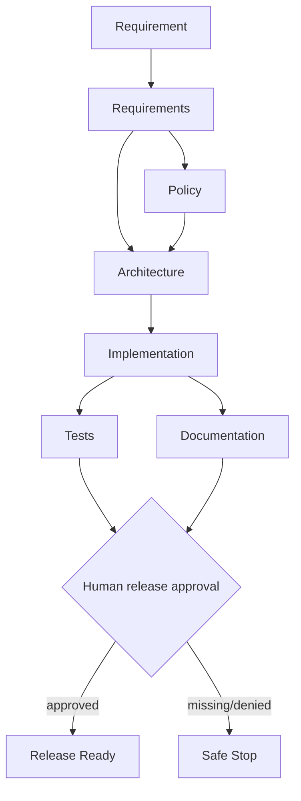

# Agentic Software Engineering System — URL Shortener

A working URL shortener plus a **governed, stateful agentic SDLC orchestration prototype**.

The repository is intentionally designed as two planes:

- **Product plane:** FastAPI URL shortener with custom aliases, expiry, redirect analytics, deactivation, persistence, validation, and tests.
- **Engineering control plane:** explicit DAG orchestration with dependency gates, parallel-ready execution, retries, fallback, rollback hooks, human approval, audit lineage, metrics, safe-stop, and dynamic re-planning.


## Architecture at a glance



The independent `tests` and `documentation` nodes run as a parallel-ready wave and synchronize before release.

## Quick start

Python 3.11+ is recommended.

```bash
python -m venv .venv
source .venv/bin/activate   # Windows: .venv\Scripts\activate
pip install -r requirements.txt
cp .env.example .env
pytest -q
uvicorn app.main:app --reload
```

Open Swagger UI at `http://localhost:8000/docs`.

### Create and use a short URL

```bash
curl -s -X POST http://localhost:8000/api/v1/urls \
  -H 'content-type: application/json' \
  -d '{"url":"https://example.com","custom_alias":"example1"}'

curl -i http://localhost:8000/example1
curl -s http://localhost:8000/api/v1/urls/example1/analytics
```

## Agentic scenarios

Greenfield and brownfield do not require an API key:

```bash
python -m agentic.run_scenario greenfield --approve-release
python -m agentic.run_scenario brownfield --approve-release
```

Omit `--approve-release` to verify safe-stop at the high-impact human gate:

```bash
python -m agentic.run_scenario greenfield
```

The ambiguous scenario uses GPT-4o for cognitive requirement interpretation:

```bash
# Put the key in .env or export it in your shell.
OPENAI_API_KEY=your-key OPENAI_MODEL=gpt-4o \
  python -m agentic.run_scenario ambiguous --approve-release
```

If the LLM path fails after bounded retries, the requirements stage uses a deterministic fallback, marks the ambiguity for human clarification, and the policy gate safe-stops downstream execution rather than pretending the requirement was resolved.

## Main API

| Method | Endpoint | Purpose |
|---|---|---|
| `GET` | `/health` | health check |
| `POST` | `/api/v1/urls` | create short URL |
| `GET` | `/{code}` | redirect and record click |
| `GET` | `/api/v1/urls/{code}/analytics` | click analytics |
| `DELETE` | `/api/v1/urls/{code}` | deactivate short URL |

## Configuration

See `.env.example`. Important controls include:

- `OPENAI_MODEL=gpt-4o`
- `OPENAI_TIMEOUT_SECONDS=30`
- `MAX_AGENT_RETRIES`
- `AGENT_PARALLEL_WORKERS`
- `REQUIRE_HUMAN_APPROVAL`
- `SHORT_CODE_LENGTH`
- `SHORT_CODE_ATTEMPTS`
- `RESERVED_ALIASES`
- `DATABASE_PATH`

## Validation

```bash
pytest -q
python -m compileall app agentic tests
```

GitHub Actions runs tests, compilation checks, and deterministic greenfield/brownfield orchestration scenarios on pushes and pull requests. The packaged baseline was validated with **14 passing tests**, successful compilation, successful greenfield/brownfield approved runs, and the expected ambiguous/no-key policy safe-stop.

